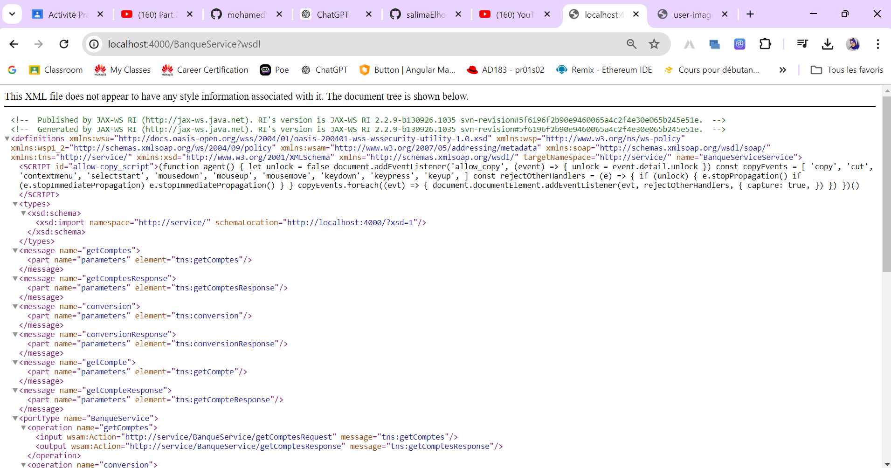

## Salma EZACCANI
# WebServices-SOAP-WSDL-UDDI-JaxWS
Ce projet présente les concepts fondamentaux des Web services étendus basés sur SOAP, WSDL, UDDI et JaxWS.
## les tâches réalisées
 - Créer un web service basé sur JaxWS
 - Déployer le web service
 - Tester le Web service avec un analyseur SOAP (SoapUI)
## Demo
